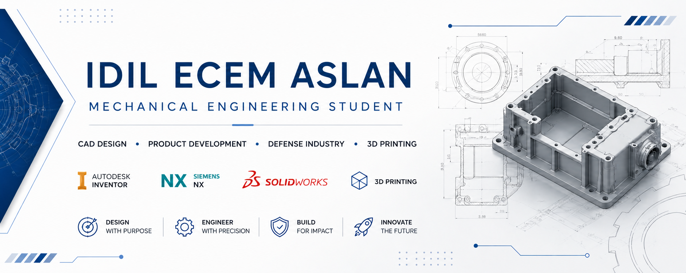

  

<h1 align="center">Hi, I'm Ecem Aslan 👋</h1>

<h3 align="center">
Mechanical Engineering Student | CAD Designer | Product Development
</h3>

---

## 👩‍💻 About Me

🎓 Mechanical Engineering student at TOBB University of Economics and Technology

🏭 Currently working as a Mechanical Engineering Intern

⚙️ Interested in:

- Mechanical Design
- Product Development
- Defense Industry
- Aerospace
- Manufacturing Technologies
- 3D Printing

---

## 🛠️ CAD & Engineering

- Autodesk Inventor
- Siemens NX
- SolidWorks
- Technical Drawings
- Design for Manufacturing (DFM)
- Sheet Metal Design
- CNC Manufacturing
- Mechanical Assembly

---

## 💻 Programming

- Python (Learning)
- C

---

## 🚀 Current Projects

- RF Enclosure Design
- Motor Driver Enclosure
- Battery & Amplifier Housing
- Functional 3D Printed Parts

---

## 🌱 Currently Learning

- Python for Engineering
- Git & GitHub
- GD&T
- Design Optimization

---

## 📫 Connect with Me

LinkedIn: https://www.linkedin.com/in/idilecemaslan/

Email: idilecemaslan@gmail.com

## 📊 GitHub Stats

